# Pinion 클라이언트 개발 레퍼런스 — Lunar Client & Feather/Dawn 완전 해부

> **문서 목적** — Pinion(가칭) 마인크래프트 클라이언트 개발을 위한 경쟁 제품 완전 분석. 런처부터 인게임까지 UI/UX·기능·수익화·기술 아키텍처를 전부 다룬다.
> **조사일** — 2026-07-24 · **대상** — Lunar Client (Moonsworth), Feather Client → Dawn (InPvP)
> **표기** — ✅ 확인된 사실 / ⚠️ 마케팅 주장·미검증 / 🔒 커뮤니티 추정(비공식)

---

## 0. TL;DR — 시장 상황과 핵심 결론

마인크래프트 서드파티 클라이언트 시장은 **2025~2026년에 대격변**을 겪었다. Pinion 입장에서 이건 기회다.

- **Moonsworth(Lunar) → Badlion 인수** (2025-03-12): 최대 경쟁자 두 개가 한 회사가 됐다. Badlion은 이제 Lunar 런처로 실행된다. 통합 MAU 300만+.
- **InPvP → Feather 인수 → Dawn 리브랜딩** (2026-05~06): Feather는 광고 사기 의혹 직후 **자산만** 매각됐고, 수백만 유저가 강제로 Dawn으로 마이그레이션됐다.
- **두 진영 모두 "기업 인수 + 강제 변경"을 저질렀다.** 커뮤니티가 가장 싫어하는 짓이다. → **독립적이고 투명한 도전자**가 들어갈 빈틈이 실제로 열려 있다.

**Pinion이 노려야 할 3대 미충족 니즈**

1. **신뢰** — Lunar는 폐쇄형+과도한 텔레메트리, Feather는 광고 사기+강제 마이그레이션. → 오픈소스/소스공개 + 최소 수집 + 광고 없음 + 강제 업데이트 없음.
2. **가벼움** — Lunar의 RAM 과다 소비는 확인된 고질병. "Lite" 포크 도구가 존재할 정도. → 진짜 가벼운 런처(빠른 부팅, 낮은 idle RAM).
3. **안 깨지는 모드 로딩** — Fabric/Modrinth 모드가 **크래시 없이 그냥 되는 것**. Lunar는 자체 난독화를 업데이트마다 랜덤화해서 커뮤니티 모드를 깨뜨린다.

---

## 1. Lunar Client (Moonsworth, LLC)


### 1.1 회사·규모 (맥락)

| 항목 | 내용 |
|---|---|
| 개발사 | **Moonsworth, LLC** — 완전 원격 스튜디오 |
| 포트폴리오 | Lunar Client, **Badlion Client**(2025-03 인수), Resourcepacks.gg, MCStats, Bedrock 마켓플레이스 |
| 창업자 | Matheus "Matt" Fonseca(CEO), Colin McDonald(CTO), Jordan Iribarren(COO) — Forbes 30 Under 30 |
| 규모 ⚠️ | **~3M MAU (2025, Badlion 통합 후)**, 26M+ 누적 다운로드, Discord 100만+ |
| 출시 | 2019-04-06 공개 · 2021-01 멀티버전 지원 · 2021-12 Lunar+ 출시 |
| 비즈니스 모델 | 클라이언트 100% 무료(**기능 페이월 0**), 수익원=코스메틱·Lunar+·Coins·Lunar FM·굿즈. 결제는 Tebex |
| 라이선스 | **클라이언트 폐쇄형/난독화**. 서버측 Apollo API만 오픈소스(MIT) |

### 1.2 런처 (게임 실행 전 데스크톱 앱)

**배포·OS·업데이트**
- `lunarclient.com/download`와 Overwolf에서만 배포. **단일 설치**로 전 버전 커버, 런처+모드 **자동 업데이트**.
- Windows 10+ (64bit), macOS Monterey+ (Intel/Apple Silicon 네이티브), Linux는 **AppImage** (Ubuntu/Debian/Fedora/Arch).

**런처 UI 구조** (좌측 아이콘 사이드바 내비게이션)

```
┌─────────────────────────────────────────────────────────┐
│  [상단바]                          [Coins] [알림🔔] [계정▾] │
├───────┬─────────────────────────────────────────────────┤
│ 🏠Home │                                                 │
│ 📰News │        [메인 히어로 / 뉴스 카드 / 파트너 서버]       │
│ 🧩Ver  │                                        ┌────────┐│
│ 🔷Expl │        ┌──────────────────────────┐    │ 친구    ││
│ ⚙️Set  │        │   버전 선택 ▾   [ ▶ PLAY ]  │    │ 목록    ││
│ ...    │        └──────────────────────────┘    │ (소셜) ││
│        │        [ Quickplay 서버 바 ]           └────────┘│
│ ⚙️(하단)│                                                 │
└───────┴─────────────────────────────────────────────────┘
```

| 섹션 | 기능 |
|---|---|
| **Home** | 추천 콘텐츠, 뉴스, 파트너 서버 원클릭 실행 타일(로고 클릭 → 해당 모드팩 프로필로 즉시 실행) |
| **News** | 클라이언트 뉴스/패치노트 |
| **Versions**(퍼즐 아이콘) | 버전 선택 + 애드온 토글 + Modpacks 서브탭 |
| **Explore**(2025-09 신설) | 모드/모드팩/리소스팩/셰이더팩/데이터팩 브라우징·설치 |
| **Settings**(톱니) | 검색바 있는 설정 |
| **계정 스위처** | 우상단 드롭다운 — 2025 리디자인으로 Coins 잔액 표시 추가 |
| **Badlion 탭** | "Use Badlion Services" 켜면 좌측에 등장(Windows 자동, mac/Linux 수동) |
| **Mission Control** | 게임과 함께 뜨는 별도 동반 창(로그/스트리머용 민감정보 숨김/위키 사이드바) |

**계정 관리**
- ✅ **Microsoft 계정만.** Java 소유 또는 Xbox Game Pass 필요. **레거시 Mojang 계정 지원 종료.** 런처 내 또는 인게임 로그인.
- 멀티 계정: 우상단 드롭다운으로 지원. 코스메틱/Coins는 **UUID에 귀속** → 닉변/마이그레이션해도 유지.

**버전 선택 & 애드온**
- ✅ 지원 버전: 1.7(1.7.10), 1.8(1.8.9), 1.12, 1.16, 1.17, 1.18, 1.19, 1.20, 1.21 — Mojang 최신 추종(2025-03 기준 1.21.5, Modrinth 리스팅은 1.21.10까지). **1.7/1.8/1.12는 레거시 PvP용 장기 유지.**
- 버전 페이지 우하단 애드온 토글: **Fabric**(→Sodium/Lithium/Iris/Indium 활성화 경로), **OptiFine**(레거시), **Forge**, **NeoForge**, **Quilt**.
- ⚠️ **커스텀 모드는 1.16+ Fabric 애드온에서만.** 1.7/1.8/1.12는 커스텀 모드 불가.

**커스텀/외부 모드 (최근 최대 변화)**
> 과거엔 아예 불가능했으나 이제 풀 파이프라인 존재.

- 이력: 모드팩(2024) → Modrinth Fabric 모드 → **CurseForge 지원(2025-02)** → **NeoForge/Quilt 내장(2025-01)**.
- Explore 플로우: 콘텐츠 타입 드롭다운(모드/모드팩/리소스팩/셰이더) → **CurseForge↔Modrinth 소스 스위처** → 모드 URL 붙여넣기도 가능 → **Install** → 호환 프로필 선택 → 버전 선택("Recommended" 태그 권장) → **의존성 자동 설치**.
- 커스텀 모드팩 생성: "Create" → 버전+로더 선택 + **"Use Lunar Features" 토글**(Lunar 모드/코스메틱/이모트 유지).
- 수동 로딩: 런처에 **드래그앤드롭** 또는 버전 설정 → 폴더 아이콘으로 모드 디렉토리 열기.
- ⚠️ 호환 주의: 일부 CurseForge 모드는 Lunar 기능과 충돌 → 프로필별로 "Use Lunar Features" 비활성 가능.

**런처 설정**

| 설정 | 상세 |
|---|---|
| Allocated Memory | RAM 슬라이더(자동 추천). 가이드: ≤4GB→1GB, ≤6GB→2GB, ≥8GB→3GB, ≥9GB→최대 4GB. 1GB 미만/4GB 초과 비권장(GC 오버헤드) |
| JVM Arguments | 2025-11 추가 — 모든 프로필(Lunar/Vanilla/Modpack/Badlion)에서 사용 가능 |
| 기타 | 시작 해상도, 게임 디렉토리, 부팅 시 자동 시작, 광고 없음 토글(Lunar+), Use Badlion Services |
| Storage 탭 | 색상별 저장공간 사용량 + 캐시 삭제, 게임 로그 설정 |

**서버·소셜·친구**
- 파트너 서버 원클릭 조인: **Complex Gaming, Wynncraft, MCC Island, Hypixel**(공식 Skyblock 모드팩), Hoplite 등.
- 친구 목록 **최대 100명**(Lunar+ 시 무제한), **그룹챗 최대 24명**(Lunar+), 활동 상태 표시.
- **Hosted Worlds**(2023-07): 싱글 월드를 친구용 무료 멀티서버로. **Simple Voice Chat 기본 번들**(2025-02~).

### 1.3 인게임 클라이언트 (플레이 중 오버레이/모드)


**모드 메뉴 열기** — ✅ **Right Shift**(기본), 또는 메인 메뉴 좌하단 Lunar 로고 클릭. 메인 메뉴 하단바에 코스메틱 메뉴, 마인크래프트 설정, 언어, 스킨 체인저, Realms 노출.

**ModMenu 탭 구성**

| 탭 | 내용 |
|---|---|
| Mods | 모드 on/off, 각 모드별 설정 패널 |
| Settings | General + **Performance** 서브섹션 |
| Controls | Lunar 전용 키바인드(모드메뉴/웨이포인트/이모트/친구메뉴 등) |
| Theme manager | 메인 메뉴 파노라마 테마(Classic, Bedrock 등) |

**HUD/레이아웃 에디터**
- RShift 메뉴 안에서 바로 편집: HUD 요소 **드래그 이동**, **모듈별 개별 리사이즈**, 스냅/정렬.
- 모듈별 커스터마이즈: **크기, 색상, 배경색, 크로마 효과, 위치** + 모듈 고유 토글.

**전체 모드 카탈로그 (75+ / 공식 카피 기준)**

기본 활성 모드(설치 즉시 켜짐):

| | | | |
|---|---|---|---|
| 1.7 Visuals | Armor Status | Boss Bar | Chat |
| Cooldowns | Coordinates | Direction HUD | Freelook |
| Hypixel Bedwars | Hypixel Mods | Lighting | Menu Blur |
| NameTags | Pack Organizer | Potion Effects | Saturation |
| Scoreboard | Screenshot Uploader | Scrollable Tooltips | Tab Editor |
| Team View | Titles | Toggle Sneak/Sprint | Waypoints · Zoom |

기본 비활성 모드(직접 켜야 함):

| | | | |
|---|---|---|---|
| 2D Items | 3D Skins | Auto Text Hot Key | Better Sounds |
| Block Outline | Chunk Borders | Clock | Color Saturation |
| Combo Counter | CPS | Crosshair | Day Counter |
| Fog Customizer | FOV Changer | FPS | Glint Colorizer |
| Hitbox | Hit Color | Hurt Cam | Hypixel Quickplay |
| Item Counter | Item Physics | Item Tracker | Key Strokes |
| Memory Usage | Momentum Mod | Motion Blur | Mumble Link |
| Nick Hider | Pack Display | Particle Changer | Ping |
| Playtime | PvP Info | Reach Display | Replay Mod |
| Server Address | Shiny Pots | Snaplook | Stopwatch |
| Time Changer | TNT Countdown | UHC Overlay | WAILA |
| Weather Changer | WorldEdit CUI | | |

**2025 신규 모드**: TierTagger(닉네임에 PvP 티어 표시), Kill Sounds, Subtitles, Mob Size, Inventory Mod(슬롯 잠금/바인딩), Markers(팀원 핑), **Rewind**(자체 캡처+에디터, 10분 소급 "Shadow Rewind"), Skyblock 스위트(던전맵/경매장·바자 툴팁 가격 등).

**성능/FPS 부스트 내부**
- ⚠️ **자동 FPS 부스트**(설정 불필요). 공식 주장: FPS 흔히 **2배**, 저사양에서도.
- **Turbo Entities**(자체 "Turbo Engine"의 일부, 🔒 독점): 엔티티 처리 비용 감소, **1.17+ 전용**, 기본 on. `RShift → Mods → Settings → Performance → Turbo Entity Mode`.
- 기타: **Lazy Chunk Loading**, 타일엔티티 렌더 거리, 엔티티 렌더 제한, **HUD Caching**(HUD를 ~20fps로 렌더), VBO, fast math, Full Bright.
- Sodium(Fabric 애드온), OptiFine(레거시 애드온).

**인게임 코스메틱/이모트 렌더**
- 코스메틱은 **다른 Lunar 유저에게** 보임. 1인칭 손목/슈트 표시 지원.
- 이모트: 키바인드/이모트 휠. Sprays 휠 기본 **Y**. Jams는 이모트 중 라이선스 오디오 재생.

### 1.4 코스메틱 & 수익화


**무료 vs 유료 모델** — 클라이언트/기능 전부 무료. 코스메틱은 무료 획득 가능(Discord 레벨링: 이모트@15, 모자@20, 클록@25, 날개@30, **6개월 Lunar+@35**), 이벤트(Advent Calendar, Gift Gauntlet 등).

**스토어(store.lunarclient.com) 카테고리**: Pets, Wings, Coins, Lunar FM, Jams, Emotes, Lunar+, Bundles, Bodywear, Companions, Cloaks, Suits, Auras, Headwear + Orbis/Collections/Partners.

코스메틱 종류: 클록(케이프), 날개, 이모트, 펫, **Companions**(따라다니는 펫, 2025-11), **Sprays**(월드 그래피티, 2025-11), **Jams**(오디오, 2024-11), 반다나/마스크, 백팩, 슈트, 바디웨어, 손목웨어, 신발, 아우라, 모자, **Badges**(이벤트 전용, 구매 불가).

**Coins (인게임 화폐, 2025-11)** — 구매/선물 가능, 거의 전 스토어 사용. **5% 체크아웃 할인**(Lunar+ 10%와 중첩), 대량 구매 보너스. UUID 귀속, 무기한, **양도/환불 불가**. **상한 $500=55,000 Coins.** Lunar+/Radio/Jams는 Coins 구매 불가.

**Lunar+ 구독 (2021-12 출시)**

| 항목 | 내용 |
|---|---|
| 가격 | ✅ **월 $6.99부터** (월/분기/반기/연 결제, 1회성 옵션 토글도) |
| 로고 | 핑크 Lunar 로고 + 초록 "+", **3개월마다 + 색상 변경(최대 15단계)** |
| 코스메틱 | 전용 날개/신발/펫/클록/반다나/백팩/Lunar+ Glow, 월간 로테이션 이모트 + 영구 Default Dance |
| 할인 | **스토어 10% 할인**(세일·Coins와 중첩) |
| Discord | 역할+아이콘, 전용 챗, 레벨링 부스트, 전용 경품 |
| 기타 | Cloth Cloaks(실시간 물리), **친구 무제한**, 그룹챗 24명, **광고 없는 런처** |

**Lunar FM & Jams (STYNGR 제휴, 2024-11, Lunar+와 별개)** — 런처 내 라디오(지역 스테이션, Streamer-Safe 로열티프리), **Premium $4.99/월**(광고 없음+전용 스테이션+인게임 헤드셋 코스메틱). Jams는 실제 라이선스 트랙(Drake, Kendrick Lamar 등) 오디오 이모트.

**퍼스트파티 서버/"Bedwars"** — 🔒 현재 자사 네트워크 없음. 과거 Lunar Network(2019, 종료). 지금은 **서버 파트너십 + Apollo Combat 모듈**(서버가 1.8 레거시 PvP 구현)로 수익화. Hosted Worlds가 가장 근접한 퍼스트파티 멀티.

### 1.5 기술 아키텍처

| 항목 | 내용 |
|---|---|
| 오픈소스 | ❌ **폐쇄형 + ProGuard 난독화**. 서버측 Apollo만 MIT 오픈소스 |
| 주입 방식 🔒 | **Mixin(SpongePowered) + MixinExtras**로 바닐라 패치. 실행 시 번들 매핑으로 **런타임 리매핑**(Fabric 유사) |
| 멀티버전 🔒 | 단일 `multiver` 번들(`lunar.jar`/`common`/`modern`/`genesis`) + **클래스 내 버전별 메서드 변형**(예: `renderNameTag$v1_20_5`). "한 번 다운로드로 전 버전" 핵심 |
| 내부 코드네임 🔒 | `com.moonsworth.lunar`, 모드 코드네임 `ichor`(커뮤니티 모드가 `isModLoaded("ichor")`로 Lunar 감지) |
| 난독화 랜덤화 | ⚠️ 업데이트마다 난독 이름 스크램블 → **커뮤니티 모드가 깨짐**(TotemCounter/TierTagger 사례) |
| 안티치트 | ✅ 2020-10 **클라이언트측 안티치트(AAL) 제거** — 현재 자체 안티치트 없음, 서버측 의존 |
| Hypixel | ✅ **공식 파트너/승인 모드**. Hypixel 접속 시 밴 가능 모드 자동 비활성. X-ray 리소스팩 차단 |
| 배포/업데이트 | 런처가 실행 때마다 CDN에서 jar/에셋 패치(patch-on-launch) |

---

## 2. Feather Client → Dawn (InPvP)

### 2.1 ⚠️ 상태 요약 — 대부분의 가이드가 틀리는 부분 (먼저 읽을 것)

**Feather는 사실상 서비스 종료됐고 Dawn으로 대체됐다.** 단순 리네임도, 완전 무관한 신규 클라이언트도 아닌 **하이브리드**다.

```
Feather Client                    Dawn (dawn.gg)
(SilentStack/Digital Ingot)  →    (InPvP, P1zzaMC 소유)
─────────────────────────         ─────────────────────────
Electron 런처(구식·무거움)    →    Kotlin Compose 런처(신규·경량)
~40 인게임 모듈           ────→    동일 인게임 기술 계승 + "100+ 모듈"
광고 기반 수익            ─X→      코스메틱/Gems/MCPVP 수익 전환
```

**핵심 타임라인**

| 날짜 | 사건 |
|---|---|
| 2022-02 | Feather Client 최초 색인(SilentStack, Inc. / 서명은 Digital Ingot, Inc.) |
| 2026-04-26 | ⚠️ YouTuber **CalebIsSalty**가 "Feather 광고 사기" 폭로 영상 — 런처가 **최소화/잠금 상태에서도 백그라운드로 광고를 로드·갱신**해 노출/수익을 부풀렸다는 **의혹**. Iris/Lunar/Tebex가 거리 두기, Tebex 판매 중단 |
| 2026-04-29 | Feather 공식 **전면 부인**(feathermc.com/feather-ads-fraud-claims/) — 의혹은 **분쟁 중·미판결** |
| 2026-05-21 | **InPvP가 Feather 인수** 발표(UGCon, 라스베가스). Weheba: **"100% 자산 매각"** — 법적 책임 회피 위해 회사가 아닌 **인게임 기술+수백만 유저 기반만** 인수. 구 소유주 지분 0 |
| 2026-06-24~25 | **Dawn(dawn.gg) 마이그레이션 시작**. 계정/코스메틱/인스턴스/모드/설정 **자동 이전**. 구 Feather 실행 시 자동으로 Dawn으로 업데이트 |

> **정확한 프레이밍**: Dawn = 새 런처(재작성) + Feather 인게임 기술 계승 + 새 소유주(InPvP) + 새 수익/PvP(MCPVP) 방향. "그냥 리네임" 또는 "완전 신규"라고 단정하지 말 것.

### 2.2 Feather 런처 (인수 전)

- Chromium/Electron 계열 데스크톱 앱. Dawn이 이 "무거운 Electron 런처"를 명시적으로 비판하며 차별화.
- 섹션: **Home/Play**(큰 Play 버튼+버전+뉴스), **버전 선택**, **Mods**(내장 모드 토글 + 외부 모드 추가 + Modrinth/CurseForge/자체 플랫폼 브라우저), **Skin Manager**(런처에서 스킨 저장·전환), **소셜/크로스서버 챗**, **서버 호스팅** 패널, **Settings**.
- 계정: MS/Mojang 로그인(정품 계정 필요).

**지원 버전**(NamuWiki 기준): 1.8.9, 1.12.2, 1.17.1, 1.18.2, 1.19~1.19.4, 1.20~1.20.6, 1.21~1.21.10. **로더**: ≤1.12.2는 Forge, **1.17+는 Fabric**. NeoForge는 Dawn에서 "coming soon".

**모드 관리** — ~40 내장 모듈 + Forge/Fabric/NeoForge 외부 모드 드롭인(Sodium/OptiFine/Iris 등). **모드 프로필 공유**: 프로필 업로드 → 공유 코드 발급, "Load Profile"+코드로 로드. ⚠️ 내장 모듈이 폐쇄형/난독화라 서드파티 모드와 충돌 잦음.

**무료 서버 호스팅** — ✅ **내 PC에서 무료로 서버 호스팅, 포트포워딩 불필요**. 플레이어는 **Feather 프록시 네트워크** 경유(내 실제 IP 은닉). **`YOURNAME.FeatherMC.GG`** 무료 서브도메인 제공. PC 켜져 있는 동안만 유지.

### 2.3 Feather 인게임 클라이언트

**모드 메뉴/HUD 에디터** — 모듈 리스트 토글 + **HUD 에디터로 요소 이동/리사이즈/색상 변경**(예: Armor Status는 텍스트 색상·동적 색상·데미지 표시 방식·정렬·위치 노출). ⚠️ 키바인드가 Lunar와 다름 — **Right Shift = 모듈 토글, Right Alt = HUD 편집**(Lunar는 둘 다 RShift).

**성능/FPS** — ⚠️ 경량·고FPS 마케팅. 내부적으로 게임엔진 튜닝 + Fabric 성능 모드(Sodium류) 로드. 현실: FPS 향상은 실제이나 **PvP 중 프레임 드롭** 불만이 흔했고 최상위 PvP 클라이언트로는 평가되지 않음.

**음성 채팅(내장)** — ✅ **Voice 모듈**로 다른 Feather/Dawn 유저와 통화. 입력/출력 장치·볼륨·PTT vs 음성감지 설정. **근접 음성**(거리에 따라 볼륨) 지원, **크로스서버/모든 서버**에서 작동(게임서버가 아닌 Feather 인프라 통한 client-to-client). Dawn에서 욕설 필터 추가 예정.

**크로스서버 통신/친구/파티** — 어느 서버에 있든 친구와 인게임 챗. Dawn은 **DM, 그룹챗, 인게임 오버레이, Xbox 친구 임포트, 마인크래프트 네이티브 친구 시스템(예정)**으로 확장.

**코스메틱** — 케이프/날개/펫/모자/아우라/실드/백/얼굴/팔/발. Discord 연동 시 무료 케이프(2024-08~). Tebex 판매(스캔들 중 Tebex 관계 단절). 코스메틱은 Dawn으로 이전.

**전체 모듈 리스트** (NamuWiki Feather + Dawn 홈페이지 기준. `[1.12.2+]`=1.12.2 이상 전용)

Animations · Armor Bar · Armor Status · Attack Indicator `[1.12.2+]` · Auto Perspective · Auto Text · Autohide HUD · Backups `[1.12.2+]` · Block Indicator · Block Overlay · Boss Bar · Brightness · Camera · Color Saturation · Combo Display · Coordinates · CPS · Cull Logs · Custom Advancements · Custom Chat · Custom Crosshair · Custom F3 · Custom Fog · Damage Indicator · Dark Mode · Death Info · Direction · Discord(rich presence) · Drop Prevention · Elytras `[1.12.2+]` · FOV Changer · FPS · Glint · Hearts · Hitbox · Hit Indicator `[1.12.2+]` · Horses `[1.12.2+]` · Hypixel · Inventory · Item Counter · Item Despawn · Item Info · Item Physic · Jump Reset · Keybind Search · **Keystrokes** · Light Level Overlay · Loot Beams `[1.12.2+]` · Mob Overlay · Motion Blur · **Mousestrokes** · Nametags · Nick Hider · Pack Display · Pack Organizer · Paperdoll · Particles · Perspective(freelook) · Ping · Playtime · Player Model · Potion Effects · Reach Display · Reconnect · Saturation · Scoreboard · Screenshot · Server Address · Shield Status · Shulker Tooltips `[1.12.2+]` · Snaplook · Sound Filters · Speed Meter · Stopwatch · Subtitles `[1.12.2+]` · System Resources · Tablist · Time · Time Changer · Title Tweaker · TNT Timer · Toast Control `[1.12.2+]` · Totem `[1.12.2+]` · **Toggle Sprint** · Tooltips · TPS · UHC Overlay · UI Scaling · ViewModel `[1.12.2+]` · Visuals `[1.12.2+]` · **Voice** · Waypoints · Weather Changer · **Zoom**

### 2.4 Dawn (dawn.gg) — 후속작

**정체** — "Java + Bedrock용 무료 마인크래프트 런처·클라이언트", InPvP 제작, **MCPVP** 제휴, "#1 Free Minecraft Java Client", 현재 v1.0.0.

**기술 차별점** — 런처를 **Kotlin Compose + 자체 UI로 처음부터 재작성**. **Chromium/Electron/내장 브라우저 없음** → 빠른 부팅, 낮은 RAM. Feather의 구식 Electron 런처(및 백그라운드 광고 이슈)를 직접 겨냥.

**런처 기능**

| 기능 | 상세 |
|---|---|
| 프로필 | **버전당 무제한 프로필**(각각 모드/리소스팩/셰이더/설정), 멀티 인스턴스, 로그 뷰어 |
| 모드 | **원클릭 Modrinth 모드팩** + Modrinth 모드 브라우저(선택적 자동 업데이트) |
| 플레이어 프로필 | 배너/스크린샷/바이오/상태/소셜/서버 통계/코스메틱 쇼케이스 — "마인크래프트 대표 프로필" 지향 |
| 소셜 | 런처 내 커뮤니티 포럼·건의, DM·그룹챗·인게임 오버레이, Xbox 친구 임포트 |
| 플랫폼 | **Linux(Flatpak/tarball)** 추가, Windows/macOS(Apple Silicon), 독립형 Fabric 모드 JAR, **Bedrock 지원**(CPS/FPS/키스트로크 오버레이 — "최초의 non-injectable Bedrock 커스텀 클라이언트") |

**MCPVP 제휴 (전략적 전환)** — Dawn은 **MCPVP.com 공식 런처**. 매 설치에 **MCPVP 빌드 패키징**. 런처에서 **바로 듀얼 큐**(서버 접속 없이), 파트너 서버(Donut SMP, PvP Club) 크로스서버 듀얼, 커스텀 큐 음악/매치메이킹, mcpvp.com **인증 체크마크**, **MCPVP 서버와 직접 통신하는 내장 안티치트**, 런처 내 플레이어 티어 조회. **토너먼트는 런처 사용 필수**(우승 검증). Dawn이 **$100,000 MCPVP 토너먼트 상금** 후원, MCPVP는 파트너 서버에 **~25ms 지연 감소** 등 클라이언트측 PvP 개선 추가.

**마이그레이션** — 2026-06-25부터 웨이브 자동 이전(구 Feather 실행 → 자체 Dawn 업데이트, Feather 모드 프로필 임포트) 또는 dawn.gg에서 조기 다운로드. ⚠️ 모든 서드파티 모드 호환 보장 아님 → 월드/키바인드/서버목록 백업 권고.

### 2.5 기술 아키텍처

| 항목 | 내용 |
|---|---|
| 인게임 | Forge/Fabric **클라이언트측 모드**(독립 클라이언트가 아닌 기술적으로 "모드"), **폐쇄형/난독화**, **Mixin + access widener**로 ~26개 버전·다중 로더 훅 |
| Dawn 스택 | JVM 성능 튜닝(JIT C1/C2, escape analysis, G1/ZGC/Shenandoah, async-profiler/JFR), 스냅샷별 Mixin/매핑 유지, **e2e 이미지 회귀 테스트 + 벤치마크 모드**, 모드 충돌 감지, **Vulkan+OpenGL 백엔드 렌더 그래프/RHI**(26.2에서 Mojang이 Vulkan 추가) |
| 런처 | **Kotlin Compose**, 커스텀 UI, 브라우저 엔진 없음 |
| 오픈소스 | ❌ 폐쇄형/난독화(광고 코드 감사 불가 → 스캔들의 핵심) |
| OS | Feather=Win/mac → Dawn은 **Linux+Bedrock** 추가 |
| 수익화 | 둘 다 무료(정품 계정 필요). Feather=광고(사기 의혹의 근원) → Dawn은 **광고 의존 축소 + D2C(코스메틱/아이템/Gems 화폐/스토어) + MCPVP 생태계**. Weheba: 첫 12개월 흑자 미예상, Aditude 광고 파트너 관계 재개 |

### 2.6 ⚠️ 광고 사기 논란 (사실관계)

- **의혹(CalebIsSalty, 2026-04-26)**: Feather 런처가 최소화/투명/잠금 상태에서도 광고를 로드·갱신해 노출·수익을 부풀렸다(수백만 부정 노출), 업계 "viewable ad" 기준 우회.
- **Feather 반박(2026-04-29)**: 최소화/종료 시 광고 미실행, 다중 도메인은 표준 광고 라우팅/A-B 테스트, 난독화는 영상 이전(1월)부터.
- **판정**: **분쟁 중·미판결(alleged).** 다만 평판 타격은 심각했고 인수로 직결. 인수를 **자산 매각**으로 구조화한 이유가 바로 이 잠재적 법적 책임 회피.
- 🔒 이용자 반발로 **FeatherClient-Patch**(Dawn 자동 업데이트 차단·광고 제거·DevTools 재활성) 스크립트가 등장.

---

## 3. 경쟁 구도 비교표

| 클라이언트 | 소유주 | 모델 | 강점 | 약점 |
|---|---|---|---|---|
| **Lunar** | Moonsworth | 폐쇄·무료+코스메틱/Lunar+ | 최고의 올라운더, 최광범위 버전(1.7~1.21.x), 세련된 UI, 커스텀 멀티버전 엔진 | RAM 과다, 폐쇄+과도 텔레메트리, 모드 로딩 취약, 수익화 반감 |
| **Badlion** | Moonsworth(2025-03 인수) | 폐쇄·무료+Premium | 100+ 통합 모드, 깊은 PvP 커스텀(히트박스/크로스헤어), 낮은 RAM, Skyblock | 구식 UI 이미지, 이제 Lunar 런처로 실행 |
| **Feather→Dawn** | InPvP(2026); 구 SilentStack | 폐쇄·무료+**광고**+코스메틱 | 경량, 빠른 부팅(<5s), Java+Bedrock, Modrinth 모드팩, 무료 서버 호스팅, 음성채팅 | 광고 사기 스캔들, 강제 마이그레이션, 작은 생태계, "짝퉁" 이미지 |
| **LabyMod 4** | LabyMedia | 폐쇄·무료 | 최고의 HUD/위젯 커스텀, 애드온 마켓, **어디서나 3D 근접 음성**, 월드 공유, 500만+ | 약한 FPS 부스트 |
| **Fabulously Optimized** | 커뮤니티 | **오픈소스 모드팩** | 최대 순수 FPS(Sodium/Lithium/Iris), 자체 런처/계정 불필요 | PvP 부가기능/코스메틱 없음, 수동 셋업 |

---

## 4. UI/UX 플로우

### 4.5 실제 UI 스크린샷 (브라우저 직접 캡처)

> **이미지 출처 표기** — 파일은 모두 `./images/`에 저장.
> - ✅ **공식·무워터마크**: Lunar 런처·홈(lunarclient.com), Dawn 전체(dawn.gg), Badlion 공식(badlion.net), LabyMod 공식(laby.net).
> - ⚠️ **9minecraft 아카이브(워터마크 각인)**: 각 클라의 *실제 인게임 메뉴 상세*는 공식 사이트가 마케팅 렌더만 노출해 안 보여줘서, 실제 UI를 담은 9minecraft 캡처를 병기함. 워터마크는 소스 파일에 박혀 있어 제거 불가.
> - ⚠️ **구 Feather**: 공식 사이트(feathermc.com)가 Dawn으로 리디렉트되어 **공식 소스 소멸** → 9minecraft 아카이브가 유일 소스.

**Lunar 런처 (2023 리디자인)** — 상단 탭 Home/Servers/Settings/About/Store, 그린 "LAUNCH 1.8.9" 버튼, 하단 Quick Play 서버 바(Hypixel 등 아이콘), 우측 FRIENDS 패널(온라인/최근접속 + 비행기 메시지 아이콘), 상단 레드 세일 배너.

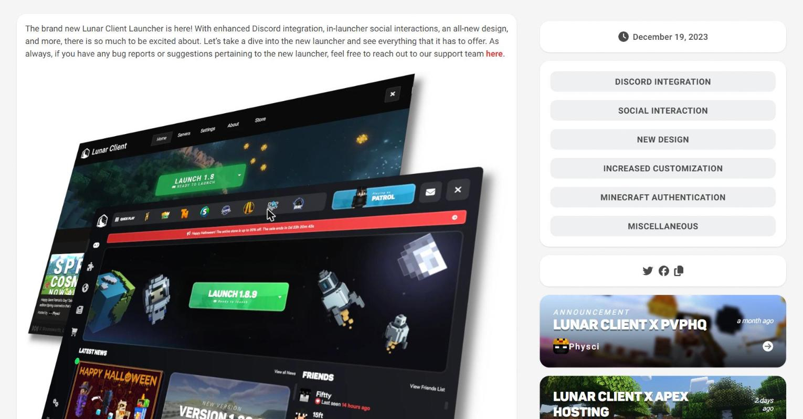

**Dawn 홈 (신규, 픽셀아트/오렌지)** — "#1 Free Minecraft Bedrock/Java Client", Download for Windows + Download Standalone(Fabric Mod Jar), SIGN IN WITH XBOX, "BROUGHT TO YOU BY InPvP / PARTNERED WITH MCPVP".

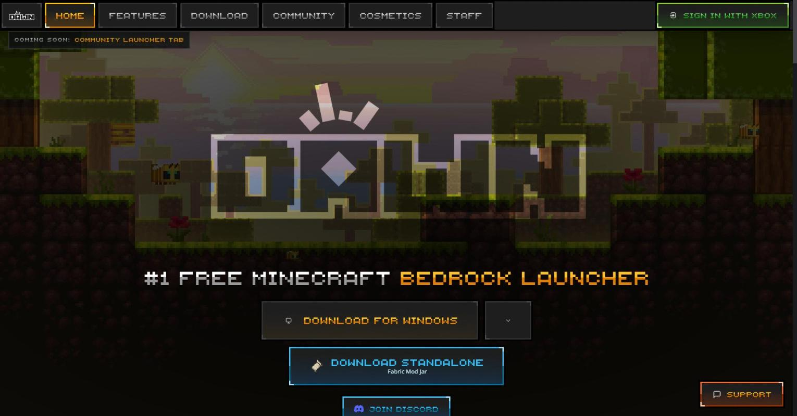

**Dawn 인게임 ModMenu** — 상단 툴바(MOD MENU/기어/아이콘들), 모듈 설정 패널(예: Voice = Receive Mode EVERYONE/PARTY, PTT 키, Voice Activation OFF/PROXIMITY/PARTY, Capture Device/Amplification), 우측 **라이브 MOD PREVIEW** 창, 하단 "100 MODS, ALL TOGGLEABLE" 모듈 캐러셀 + "Search 100 modules".

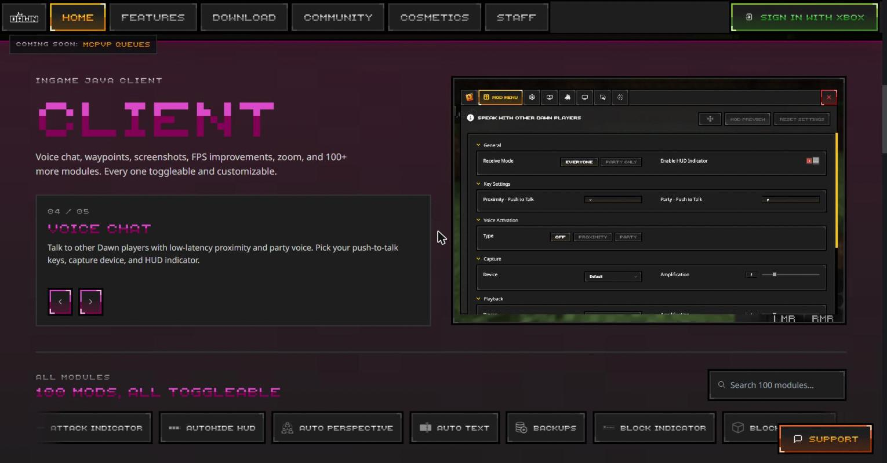

**Dawn 런처 (프로필 생성)** — PROFILES 탭(Friends/Custom/Modpack), "CREATE CUSTOM PROFILE" 모달(Name, Mod Loader=Fabric, Minecraft Version=26.2, 버전 선택), NEW PROFILE + 검색. 우측 카피 "The most customizable Minecraft launcher. Unlimited profiles, one-click Modrinth modpacks, multi-instance support, built-in log viewer."

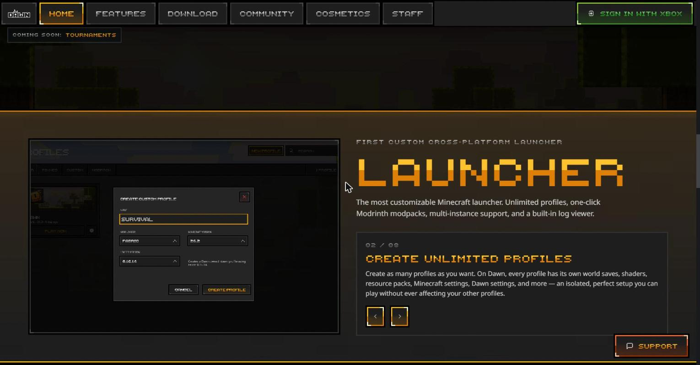

**구 Feather 런처 — Play 화면 (당신이 선호한 UI)** — 다크 + 황혼 그라디언트, 좌측 슬림 사이드바(Play/Mods/Account/Settings), 버전 탭(1.8.9/1.12.2/1.17.1/1.18.1), **레드 "Launch Forge" 버튼**, Partner Servers(Purple Prison/CycloneMC), 우측 뉴스/랜딩 카드, 상단 Invite a friend + 소셜 아이콘 + 계정.

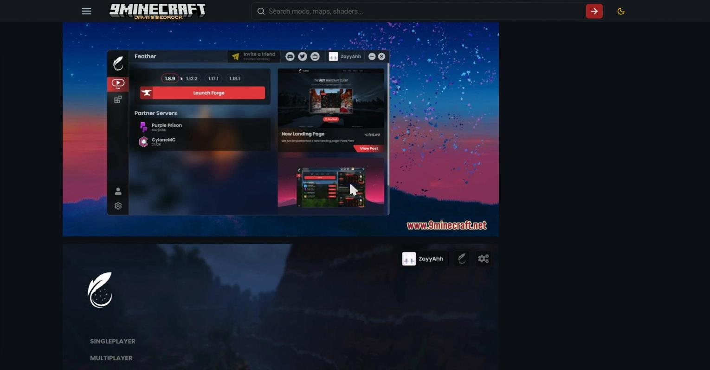

**구 Feather 런처 — 설정 화면** — Allocated Ram(슬라이더, 4001MB), Minecraft Path, After Launch(Keep Open/Hide), Resolution(Auto×Auto), Repair Game. 깔끔한 라벨+설명 2열 레이아웃.

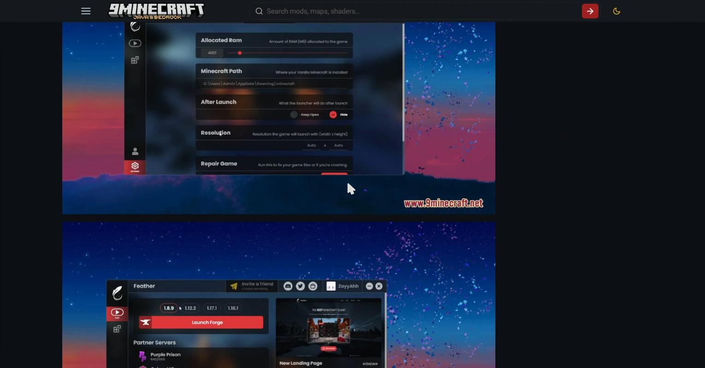

**구 Feather 인게임 Mod Menu (모듈 오버뷰)** — 좌측 세로 사이드바(FEATHER MODE/GENERAL/CHAT OPTIONS/PERFORMANCE), 헤더 "Mod Menu" + 카테고리 탭 **All / HUD / Hypixel / PvP** + "Search Mods" 검색, 우상단 툴바(이동/**하트=즐겨찾기**/그리드뷰/리스트뷰 전환). 모듈 카드 그리드(Animations, Armor Status, Auto Text, Block Overlay, Boss Bar, CPS, Clear Water, Combo Display, Coordinates, Custom Crosshair, Direction, Discord, FOV Changer, FPS, Glint, Hitbox, Hypixel, Item Counter …) — 각 카드에 **레드 토글 + 하트 즐겨찾기**. 전체적으로 다크 + 레드 액센트, 둥근 모서리 카드. (Dawn의 픽셀아트 캐러셀보다 훨씬 앱스러움.)

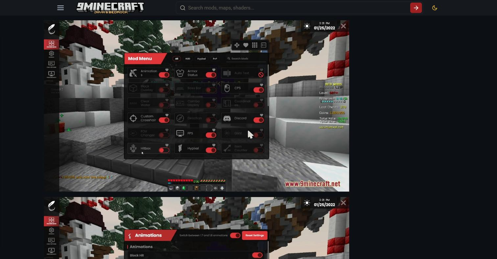

**구 Feather 인게임 모듈 설정 + 라이브 프리뷰 (예: CPS)** — 모듈 클릭 시 상세 설정 진입: Digits(슬라이더), Right, Show CPS Text, Line Color / **Style**(Display Mode = Background/Brackets/Just Text, Text, Text Shadow) + 우측 **실시간 인게임 프리뷰 창**. 상단 헤더에 on/off 토글 + 이동 아이콘 + **Reset Settings**. → Dawn이 이 "설정+라이브 프리뷰" 패턴을 그대로 계승했음을 알 수 있음(스타일만 픽셀아트로 변경).

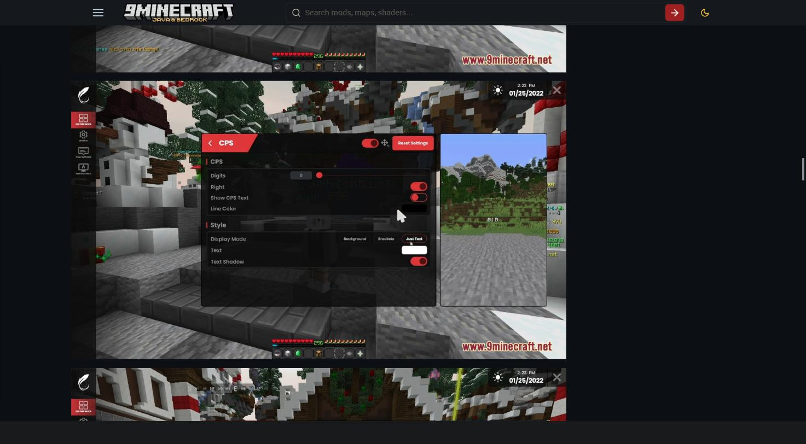

> **디자인 인사이트 (당신의 선호와 연결)** — 구 Feather의 인게임 UI = **매끈한 다크 카드 + 레드 액센트 + 즐겨찾기(하트) + 카테고리 탭 + 라이브 프리뷰**. Dawn은 이 UX 구조(설정+프리뷰, 모듈 그리드)는 유지하되 비주얼을 레트로 픽셀아트로 갈아엎음. **Pinion 권장 방향**: 구 Feather의 앱스러운 다크 스킨 + 즐겨찾기·카테고리·검색 + 라이브 프리뷰를 계승하고, Lunar식 통합 HUD 드래그 에디터의 편의(스냅/모듈별 스케일)를 얹는 하이브리드.

### 4.6 추가 인게임/에디터 스크린샷 (Lunar · Badlion · LabyMod + 구 Feather 심화)

> Lunar 공식·무워터마크 자산은 **런처 조합샷(§4.5)** + **기능 카드(§1.2/§1.3의 CDN 이미지)**. 아래 인게임 ModMenu 상세는 공식 사이트가 안 보여줘 9minecraft 아카이브로 병기.

**Lunar 인게임 ModMenu ⚠️(9minecraft 아카이브)** — 상단 **MODS / SETTINGS / WAYPOINTS** 탭, 카테고리 필터 **ALL / NEW / HUD / SERVER / MECHANIC** + 검색 + 그리드뷰, **좌측 프로필 사이드바**(Default/UHC/Hypixel Skyblock/Arena PvP — 프로필별 모드 세트), 모듈 카드마다 **OPTIONS 버튼 + 기어 + ENABLED/DISABLED(초록/빨강)**, 하단 **SAVE AS NEW PROFILE** + 파란 **EDIT HUD LAYOUT** 버튼. 화면엔 실제 HUD(WASD 키스트로크, CPS, 통계)가 떠 있음.

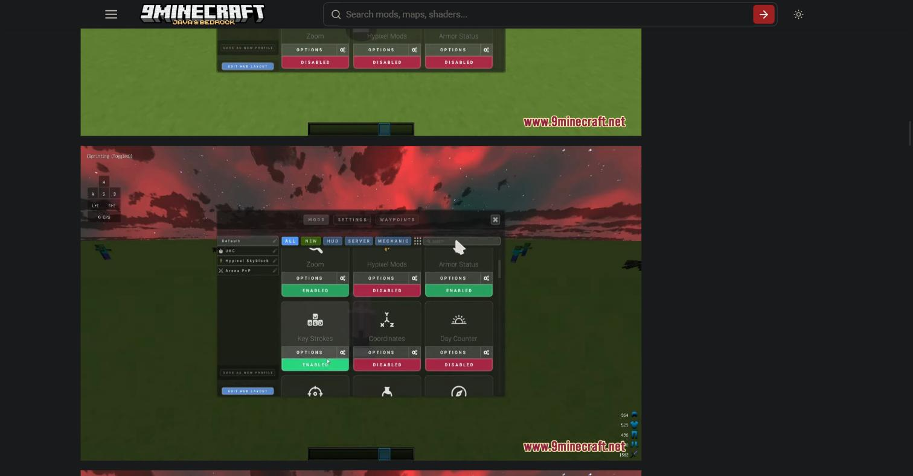

**Lunar 모듈 옵션 패널 (예: Auto Text Hot Key) ⚠️(9minecraft 아카이브)** — 모듈별 상세 설정. Auto Text는 Key 1~15에 각각 `/Command`+키바인드 지정(⚠️ Hypixel 밴 가능 기능). 좌측 프로필 사이드바 + EDIT HUD LAYOUT 유지.

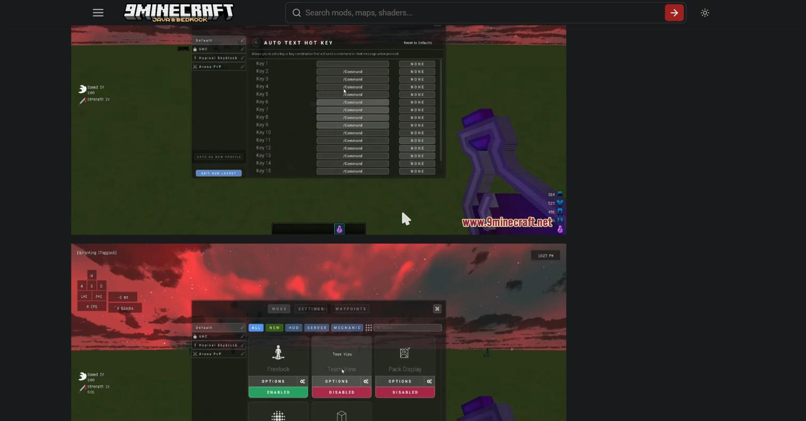

**구 Feather 인게임 General 설정** — Show Mods in Chat/Inventory, **Mod Preview**(배경 Mountains/Ocean/Skyblock), **UI Quality**(Ultra/High/Medium/Low), 24 Hour Close, **HUD Editor: Open HUD Editor = RSHIFT**, Line Color. (설정 탭은 블루 액센트, 모듈 설정은 레드 — 이원 액센트.)

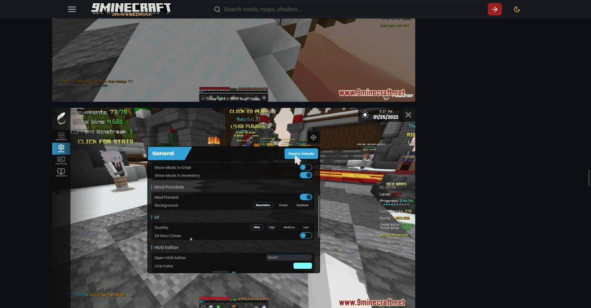

**Badlion — ✅ 공식(badlion.net)** — "The Ultimate Client for the Best Minecraft Gameplay", 블루 액센트, Players Online 실시간 표시, Badlion Points/Premium. 공식 페이지엔 클라 vs 경쟁 **FPS 비교표**(Vanilla 520 / 타클라 1090·1145 / **Badlion 1600+**, Mods 100+)도 있음(⚠️ 자사 마케팅 수치).

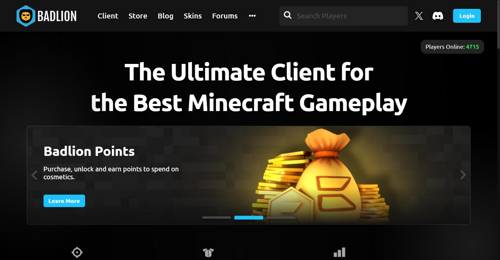

**Badlion 인게임 메뉴 ⚠️(9minecraft 아카이브)** — **BADLION CLIENT** 헤더, **Mods / Settings / Profiles** 탭 + 검색, **좌측 Categories 사이드바**(General/Graphics/Betterframes/Friends/Chat/Menus/Cosmetics), Cosmetics 세부 토글(Cloaks, Cloak Particles, Wings, Shields, Hats, HD Skins, Item/GUI Cosmetics, Emotes …). **블루 액센트**, 깊은 설정 세분화(Lunar보다 커스텀 폭 넓음). *(공식 사이트가 인게임 메뉴를 안 보여줘 실제 UI는 아카이브 병기.)*

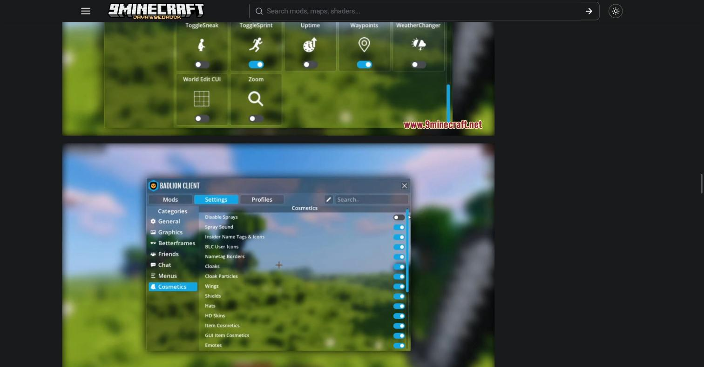

**LabyMod — ✅ 공식(laby.net)** — "One Client. Everything included.", 블루 테마, 통계 **100+ Mods / 5M+ Users / 20+ Minecraft Versions**. 우측에 공식 **모듈 토글 UI 목업**(Performance/Motion Blur/FOV Changer/Fullbright + 기어·핫키, HUD 섹션: LabyMod Widgets/Fancy Font/Advanced Chat) — 실제 설정 메뉴 구조를 무워터마크로 보여줌.

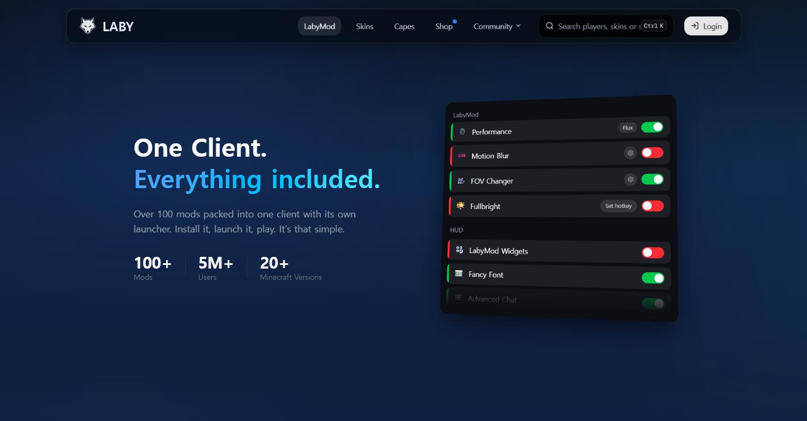

**LabyMod GUI 에디터 (HUD 위젯 에디터) ⚠️(9minecraft 아카이브)** — **LabyMod GUI** on/off + 기어, **좌측 카테고리 사이드바**(Information 7/18, Items 4/6, External services, Miscellaneous, GommeHDnet — 서버별 위젯도!), **Ingame / In Menu** 탭, 우측 **라이브 인게임 프리뷰에 위젯 배치**(FPS/BPS/좌표 좌상단, 포션 우상단). 위젯을 끌어 배치/스케일하는 방식. (마인크래프트 흙 텍스처 UI = 바닐라 친화 스타일.)

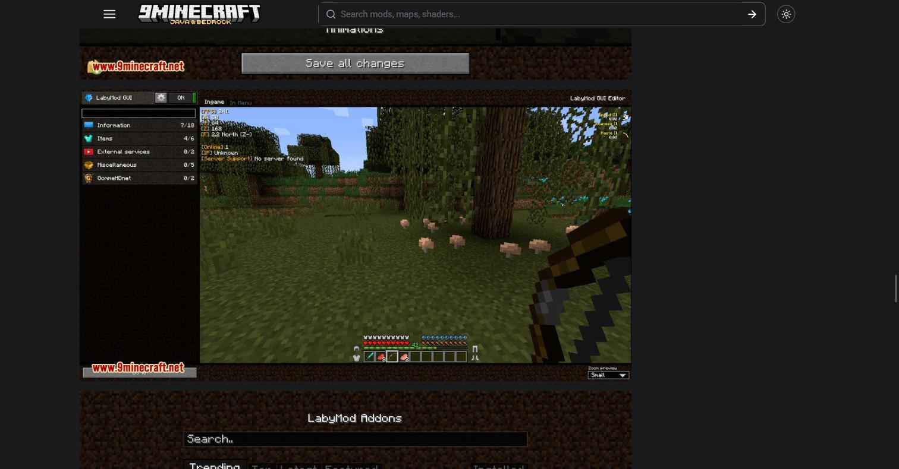

**LabyMod 애드온 마켓플레이스 (핵심 차별점) ⚠️(9minecraft 아카이브)** — **Trending / Top / Latest / Featured / Installed** 탭 + 검색, 애드온 카드(Laby's Minimap, VoiceChat, Spotify, Controller … by LabyStudio, 별점 + 다운로드 버튼). **런처 밖에서 커뮤니티 애드온을 인게임 마켓에서 원클릭 설치** — Lunar/Badlion엔 없는 생태계.

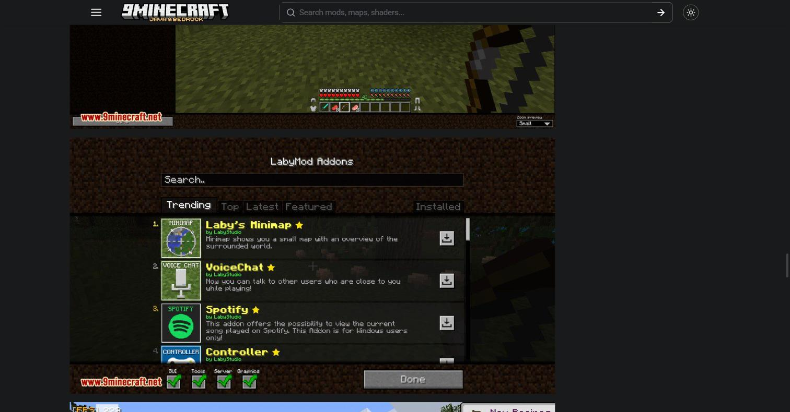

### 4.7 HUD 에디터 & 모듈 UI 패턴 비교 (실제 캡처 기반)

| 클라이언트 | 모듈 UI 형태 | HUD 편집 방식 | 프로필/카테고리 | 액센트 | 특이점 |
|---|---|---|---|---|---|
| **Lunar** | 카드 그리드 + OPTIONS/ENABLED | **EDIT HUD LAYOUT** 버튼 → 통합 드래그 | **프로필 사이드바**(UHC/Skyblock/PvP) + ALL/NEW/HUD/SERVER/MECHANIC | 다크+그린 | 프로필별 모드셋, 라이브 HUD |
| **구 Feather** | 카드 그리드 + **하트 즐겨찾기** | RSHIFT HUD 에디터 + 모듈별 라이브 프리뷰 | All/HUD/Hypixel/PvP 탭 | 다크+레드(설정은 블루) | 즐겨찾기, 매끈한 앱 스킨 |
| **Dawn** | 픽셀 캐러셀 + 검색 | 모듈 설정 + 라이브 프리뷰(구 Feather 계승) | 프로필 무제한 | 픽셀+오렌지 | 레트로 스타일, 100+ 모듈 |
| **Badlion** | 카드 그리드 + 블루 토글 | 모듈별 설정 | **Categories 사이드바**(Graphics/Chat/Menus/Cosmetics) | 다크+블루 | 최다 세분화 옵션 |
| **LabyMod** | 리스트 + ON/OFF·기어 | **GUI Editor 위젯 드래그**(Ingame/In Menu) | 카테고리 + **서버별 위젯** | 흙 텍스처(바닐라풍) | **애드온 마켓플레이스** |

> **Pinion 종합 권장** — ① 모듈 UI: 구 Feather식 **카드 그리드 + 하트 즐겨찾기 + 카테고리 탭 + 검색**(가장 앱스럽고 당신 선호), ② HUD 편집: Lunar식 **통합 드래그 + 스냅** + 모듈별 **라이브 프리뷰**(Feather/Dawn), ③ 프로필: Lunar/Dawn식 **프로필별 모드셋**, ④ 확장성: LabyMod식 **애드온 마켓**(장기 생태계), ⑤ 커스텀 폭: Badlion 수준의 세분화 옵션. 스킨은 매끈한 다크 + 고유 액센트(비-오렌지/비-퍼플).

---

**Lunar 런처 유저 여정**

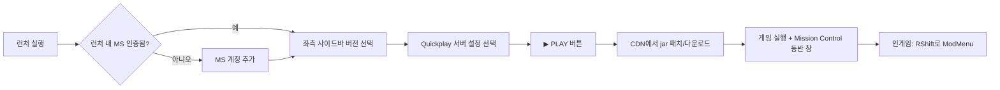

**인게임 HUD 편집 (Lunar vs Feather/Dawn)**

| | 모듈 토글 | HUD 이동/편집 | 특징 |
|---|---|---|---|
| Lunar | Right Shift | Right Shift(같은 메뉴 내) | 통합, 모듈별 크기/색/크로마 |
| Feather/Dawn | Right Shift | **Right Alt**(분리) | 토글/이동 키 분리 → 명확성 |

**디자인 언어** (✅ 브라우저 직접 캡처로 확인 — 아래 §4.5 스크린샷 참조)
- **Lunar**: 다크 뉴트럴 테마 + 흰색 달 로고, **그린 실행(Launch) CTA**, 상단 레드 세일 배너, 대형 히어로 이미지 + 강한 애니메이션, "프리미엄 앱" 느낌. 코스메틱 프리뷰=**드래그·줌 가능한 8개 3D 바이옴 배경**. 런처 상단 탭 = Home/Servers/Settings/About/Store, 우측 상시 친구 패널.
- **Feather (구버전, 인수 전)**: 다크 + **황혼(dusk) 그라디언트 배경**(블루→핑크/퍼플) + **레드 액센트**, 좌측 초슬림 아이콘 사이드바(Play/Mods/Account/Settings), 미니멀. 세련되고 "Lunar 계열" 느낌. → **사용자(당신)가 선호한다고 밝힌 UI.**
- **Dawn (신버전)**: ⚠️ 방향 급전환 — **레트로 픽셀아트 + 오렌지/앰버 액센트**, 픽셀 폰트, 상단 가로 탭(HOME/FEATURES/DOWNLOAD/COMMUNITY/COSMETICS/STAFF) + "SIGN IN WITH XBOX". Feather의 매끈한 다크 UI를 버리고 마인크래프트풍 픽셀 스타일로 감. **호불호가 크게 갈리는 지점**(구 Feather UI 선호층 이탈 리스크). 참고로 dawn.gg 자체에도 광고 슬롯이 노출됨.
- **Pinion 시사점**: Lunar=다크+그린, Dawn=픽셀+오렌지, 구 Feather=다크+레드 그라디언트. **틈새 = 구 Feather 같은 매끈한 다크 UI를 계승하되(그 팬층 흡수) + 광고 없는 빠른 셸 + 뚜렷한 고유 액센트.** 당신이 구 Feather UI를 선호하는 건 곧 Pinion의 디자인 레퍼런스로 삼기 좋은 신호.

---

## 5. 사용자 불만 & 미충족 니즈 (차별화 금맥)

**Lunar 불만**
- ✅ **RAM/블로트**: "RAM 너무 많이 먹음", 메모리 릭/FPS 스파이크 보고. 기본 ~3GB 할당. → Lunar Client Lite/Fixes 같은 서드파티 도구가 존재할 정도.
- ✅ **폐쇄형 + 텔레메트리**(🔒 "스파이웨어"는 루머): ProGuard 난독화로 감사 불가. 프라이버시 정책이 실제로 광범위(기기/광고 ID, IP, 지오로케이션, 설치 앱/폰트, 상호작용 텔레메트리, GA 연동, "서비스 미사용 중에도 전송 가능"). → **"스파이웨어/채굴기" 주장은 근거 없음**이나 **"과도한 텔레메트리+폐쇄형=신뢰 강요"는 사실 기반**. **Pinion 최강 진입점.**
- ✅ **코스메틱 업셀/수익화 반감**: "이모트 터무니없이 비쌈", 페이-포-스테이터스 인식.
- ⚠️ **모드 추가 여전히 거침**: 1.16.5+ Fabric 애드온 필요, 크래시 잦고 라이브러리(Fabric API/Cloth Config 등) 수동. + **난독 랜덤화로 커뮤니티 모드 파손.**
- ✅ **버그/계정 이슈**: 크래시, "Failed to Launch", OOM, 로그인 오류(`.lunarclient` 삭제로 해결).

**Feather/Dawn 불만**
- ⚠️ **광고 사기 스캔들**(2026, 분쟁 중).
- ✅ **Dawn 강제 마이그레이션 반발**: Feather 실행 시 자동으로 Dawn 됨 → FeatherClient-Patch로 저항. 기업 정체성도 혼탁(SilentStack vs Digital Ingot vs InPvP).
- ✅ **모드 적음/작은 커뮤니티/"베타 품질"** 이미지("Lunar 짝퉁", "남의 모드 베껴 수익화").

**아무도 잘 못하는 요청 기능**
1. **신뢰성 있는 범용 서드파티 모드 로딩** — Fabric/Forge 모드가 크래시·라이브러리 헌팅·난독 파손 없이 **그냥 되는 것**. (#1 갭)
2. **진짜 낮은 RAM / 저사양 친화.**
3. **깊은 HUD/크로스헤어 커스텀**(Lunar 약점 vs Badlion).
4. **신뢰/투명성** — 오픈소스, 공격적 텔레메트리 없음, 광고 없음, 강제 마이그레이션 없음.
5. **Skyblock/유틸 모드 깊이**(비-PvP 유저용).

---

## 6. Pinion 개발 관점 — 아키텍처 힌트 & 차별화

### 6.1 아키텍처 힌트

- **멀티버전 전략**: (A) Lunar식 — 단일 클라이언트 + 런타임 리매핑 + 클래스 내 버전별 메서드 변형(고난도, "한 번 다운로드로 전 버전"). (B) Feather/Dawn·LabyMod식 — **프로필/인스턴스 기반**(버전당 별도 프로필, 구현 단순, 유연). → **Pinion 권장: 인스턴스 기반으로 시작**해 복잡도 낮추고, 안정적 주입 표면 확보.
- **주입**: Mixin + MixinExtras가 사실상 표준. **자체 난독화를 자기 생태계에 대해 랜덤화하지 말 것**(Lunar의 자충수). 안정적 매핑 = 커뮤니티 모드 호환.
- **성능**: Sodium/Lithium/Iris를 억지로 감추지 말고 **1급 통합**. FPS 주장은 실측 벤치로 뒷받침.
- **업데이트**: **opt-in·투명 업데이트**(강제 자동 마이그레이션 금지) — Feather→Dawn 사태가 남긴 신뢰 이슈를 정면 해결.
- **코스메틱 렌더**: 계정 엔타이틀먼트를 CDN에서 전달, 커스텀 클라이언트측 렌더(Lunar의 커스텀 nametag 방식이 외부 모드 렌더를 조용히 깨뜨리는 문제 회피하도록 설계).

### 6.2 차별화 포인트 (우선순위)

1. **신뢰 우선**: 오픈소스/소스공개 + 평문 프라이버시 정책("우리는 X를 수집 안 함") + **광고 없음 + 강제 마이그레이션 없음**. Lunar 텔레메트리·Feather 광고 스캔들을 동시에 반박.
2. **가벼움으로 승부**: 빠른 부팅, 낮은 idle RAM, UI에 노출된 합리적 기본 JVM args. "Lite" 포크와 Dawn 마케팅이 수요를 증명.
3. **모드 로딩 완성도**: 깨지지 않는 **Fabric/Modrinth** 지원 — 안정적 주입 표면, 라이브러리 의존성 자동 해결, 명확한 에러. **최대 미충족 니즈.**
4. **좋은 건 베끼고 약점은 날카롭게**: Lunar의 드래그앤드롭 HUD 에디터(스냅/모듈별 스케일·색상) 유지 + **Badlion급 깊은 커스텀**(크로스헤어/히트박스/전부 색상). Feather식 **2키 분리**(토글/이동) 채택 고려.
5. **반감 없는 코스메틱**: 페이-포-스테이터스/도박형 회피, 공정·투명 스토어.
6. **설계상 합법적 PvP HUD**: 키스트로크 + **히트 트리거·비예측** Reach Display(예측형은 부정행위 논란). 서버별 밴 가능 모드 자동 비활성(Lunar의 Hypixel 자동 비활성 미러링) → 파트너 자격 유지.
7. **뚜렷한 비주얼 아이덴티티**: 다른 액센트 컬러 + 광고 없는 차분한 셸 = "정직한 클라이언트".

---

## 7. 출처

**Lunar 공식/기능/코스메틱**
- https://www.lunarclient.com/features · /download · /faq · /partnerships
- https://store.lunarclient.com/category/plus
- https://www.lunarclient.com/news/mod-loading-on-lunar-client · /how-to-add-curseforge-mods-to-lunar-client · /introducing-coins-your-new-way-to-buy-cosmetics · /inside-the-new-lunar-client-store-fresh-design-better-experience · /how-to-boost-fps-in-modern-minecraft-with-lunar-client-and-turbo-entities · /lunar-client-2025-year-in-review · /lunar-client-monthly-recap-november-2025
- https://www.bisecthosting.com/blog/lunar-client-mods-list (전체 모드 리스트)
- https://www.moonsworth.com/about · https://grokipedia.com/page/Lunar_Client

**Lunar 인수/규모**
- https://www.forbes.com/sites/mattgardner1/2025/03/12/minecraft-mod-and-ugc-leader-lunar-client-acquires-rival-badlion/
- https://www.lunarclient.com/news/lunar-client-acquires-badlion-client · /badlion-acquisition-next-steps
- https://www.geekmetaverse.com/minecraft-ugc-platform-lunar-client-acquires-badlion/

**Lunar 기술/불만**
- https://uku3lig.net/posts/2024-08-20-lunar-compat/ (난독화·multiver·ichor·Mixin·리매핑)
- https://github.com/LunarClient/Apollo · https://lunarclient.dev
- https://github.com/Aetopia/Lunar-Client-Fixes
- https://www.lunarclient.com/privacy · https://ca.trustpilot.com/review/lunarclient.com

**Feather/Dawn**
- https://dawn.gg/ · https://dawn.gg/community/news/feather-is-now-dawn · https://dawn.gg/careers/client-engineer
- https://inpvp.net/dawn · https://feathermc.com/
- https://gamesbeat.com/inpvp-acquires-feather-client-rebrands-as-dawn-exclusive/
- https://en.namu.wiki/w/Feather%20Client (전체 모드 리스트·논란)
- https://www.9minecraft.net/feather-client-launcher/ · https://featherclientdownload.wiki/feather-client-dawn/
- https://feathermc.com/feather-ads-fraud-claims/ (공식 반박)
- https://github.com/dtesters/FeatherClient-Patch (Electron/asar 내부·강제 마이그레이션)
- https://www.sportskeeda.com/minecraft/feather-client-minecraft-features-download-guide

**Hypixel 합법성/경쟁**
- https://support.hypixel.net/hc/en-us/articles/6472550754962-Hypixel-Allowed-Modifications
- https://en.namu.wiki/w/Badlion%20Client · https://www.labymod.net/en

---

> **미확정·주의 사항** — ① Lunar 유저 수는 출처별 편차(2.6M→3M→4.4M), "~3M MAU(2025)" 안전. ② Lunar+ 다중월 요금은 월 $6.99 기준만 확인. ③ Lunar 빌드 내부(Mixin/CheatBreaker 계보)는 커뮤니티 추정. ④ Feather 광고 사기는 **의혹·미판결**. ⑤ Dawn 지연/성장 수치는 1차 마케팅 주장. ⑥ ~~브랜드 색상 미확인~~ → ✅ 브라우저 캡처로 확정: Lunar=다크+그린 CTA, Dawn=픽셀+오렌지, 구 Feather=다크+레드/황혼 그라디언트(§4.5). ⑦ 모드 리스트 일부는 2023~2026 시점 혼재 — 실제 클라이언트에서 최종 확인 권장. ⑧ 구 Feather 스크린샷은 9minecraft 아카이브 기준(인수 전 버전).
